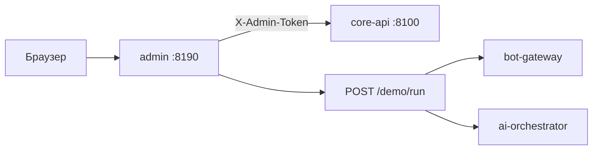

# Админ-панель

Web-интерфейс для просмотра данных клиники, аудита и запуска демо-сценария.

## Обзор

| Параметр | Значение |
|----------|----------|
| **Сервис** | `admin` (Docker Compose) |
| **URL** | `http://127.0.0.1:8190` |
| **Стек** | FastAPI + Jinja2 |
| **Backend** | Core API (`/api/admin/*`) |



## Запуск

```bash
# В .env задайте ADMIN_TOKEN
docker compose up -d admin core-api bot-gateway ai-orchestrator
```

Проверка:

```bash
curl http://127.0.0.1:8190/health
```

## Вход

1. Откройте `http://127.0.0.1:8190`
2. Введите значение `ADMIN_TOKEN` из `.env`
3. После входа токен сохраняется в httpOnly-cookie `admin_session`

| Переменная | Описание |
|------------|----------|
| `ADMIN_TOKEN` | Секрет для входа и API |
| `ADMIN_PORT` | Порт (по умолчанию `8190`) |

!!! warning "Безопасность"
    Смените дефолтный `change-me-admin-token` перед любым публичным доступом.  
    Не коммитьте `.env` в git.

## Разделы интерфейса

### Дашборд

Сводная статистика из `GET /api/admin/dashboard`:

- пациенты, записи (всего и активные)
- врачи, услуги
- свободные и занятые слоты
- события аудита

Быстрые ссылки на записи, пациентов и демо.

### Пациенты

`GET /api/admin/patients` — список зарегистрированных пациентов:

- имя, Telegram ID, телефон
- первичный / повторный визит
- дата создания

### Записи

`GET /api/admin/appointments` — все записи с фильтрацией по дате:

- пациент, врач, услуга
- дата, время, статус

### Врачи и услуги

Справочники клиники из seed / БД:

- врачи: ФИО, специальность, первичные приёмы
- услуги: название, категория, цена, привязка к врачу

### Слоты

До 80 ближайших слотов: дата, время, врач, статус (`available` / `booked`).

### Аудит

Журнал `audit_events`: тип события, actor, payload, время.

### Демо-сценарий

См. [Демо-сценарий](demo.md).

## Admin API

Все эндпoинты требуют заголовок `X-Admin-Token`.

| Метод | Путь | Описание |
|-------|------|----------|
| GET | `/api/admin/dashboard` | Статистика |
| GET | `/api/admin/patients` | Пациенты |
| GET | `/api/admin/appointments` | Записи |
| GET | `/api/admin/doctors` | Врачи |
| GET | `/api/admin/services` | Услуги |
| GET | `/api/admin/slots` | Слоты (`?limit=50`) |
| GET | `/api/admin/audit` | Аудит (`?limit=100`) |
| POST | `/api/admin/demo/reset` | Сброс демо-данных |
| POST | `/api/admin/demo/run` | Автоматический демо-сценарий |

Пример:

```bash
curl -H "X-Admin-Token: your-token" http://127.0.0.1:8100/api/admin/dashboard
```

## Сброс демо-данных

`POST /api/admin/demo/reset` удаляет:

- все записи и запросы переноса
- уведомления, idempotency-кэш, аудит
- пациентов и users (кроме `demo_patient` и `999000001`)
- сбрасывает все слоты в `available`

Используйте перед презентацией или повторным прогоном демо.

## Файлы проекта

| Файл | Назначение |
|------|------------|
| `services/admin/main.py` | Web-UI, авторизация, прокси к Core API |
| `services/admin/templates/` | HTML-шаблоны |
| `services/core_api/admin.py` | Admin REST API |
| `services/core_api/demo_reset.py` | Логика сброса |

## Ограничения MVP

- Только просмотр данных (нет редактирования врачей/услуг через UI)
- Нет RBAC внутри админки (один общий токен)
- Cookie без флага `Secure` — для production нужен HTTPS
