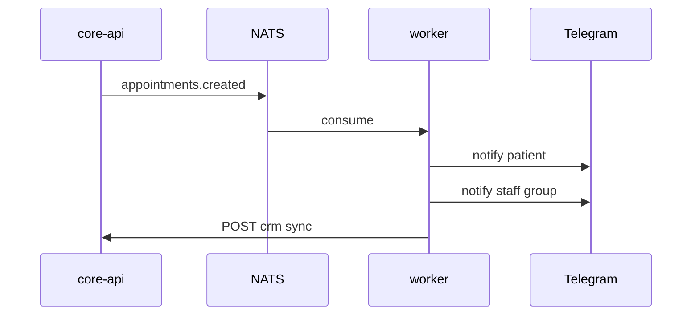

# События NATS

События публикуются через `shared/nats.py` → `EventPublisher` в формате `EventEnvelope`.

## Структура события

```json
{
  "event_id": "evt_...",
  "event_type": "appointments.created",
  "occurred_at": "2026-07-01T10:00:00Z",
  "correlation_id": "corr_...",
  "idempotency_key": "appointment-create:1001:slot_...",
  "payload": { }
}
```

## Streams и subjects

### APPOINTMENTS

| Subject | Когда |
|---------|-------|
| `appointments.created` | Новая запись |
| `appointments.cancelled` | Отмена |
| `appointments.rescheduled.by_patient` | Перенос пациентом |
| `appointments.reschedule.requested_by_doctor` | Врач запросил перенос |
| `appointments.reschedule.approved_by_patient` | Пациент одобрил |
| `appointments.reschedule.rejected_by_patient` | Пациент отклонил |

### NOTIFICATIONS

| Subject | Когда |
|---------|-------|
| `notifications.patient.reminder_24h` | Напоминание за 24 ч |
| `notifications.doctor.appointment_changed` | Изменение у врача |
| `notifications.staff.appointment_changed` | Изменение для staff |

### CRM_SYNC

| Subject | Когда |
|---------|-------|
| `crm.appointment.sync_requested` | Запрос синхронизации |
| `crm.appointment.sync_failed` | Ошибка CRM |

### REMINDERS

| Subject | Когда |
|---------|-------|
| `reminders.scan` | Триггер сканирования напоминаний |

### AUDIT

| Subject | Когда |
|---------|-------|
| `audit.events` | Аудит действий |
| `ai.intake.low_confidence` | Низкая уверенность AI |
| `ai.output.validation_failed` | Провал валидации AI |

## Инициализация

Скрипт `scripts/init_nats.py` создаёт JetStream streams при первом запуске.

## Отладка

В dev-режиме опубликованные события доступны через:

```bash
curl http://127.0.0.1:8100/debug/events
```

## Диаграмма потока записи



Конфигурация NATS: `NATS_URL=nats://127.0.0.1:4224` (host), внутри Docker-сети — `nats://nats:4222`.
