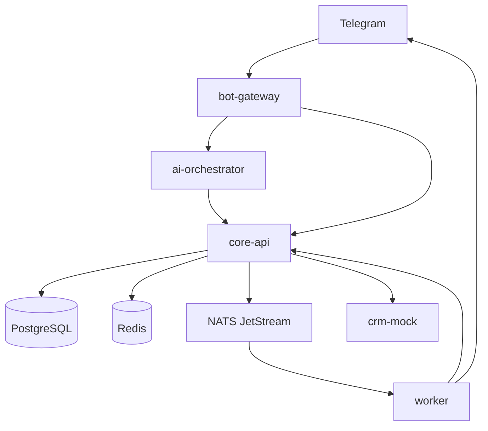
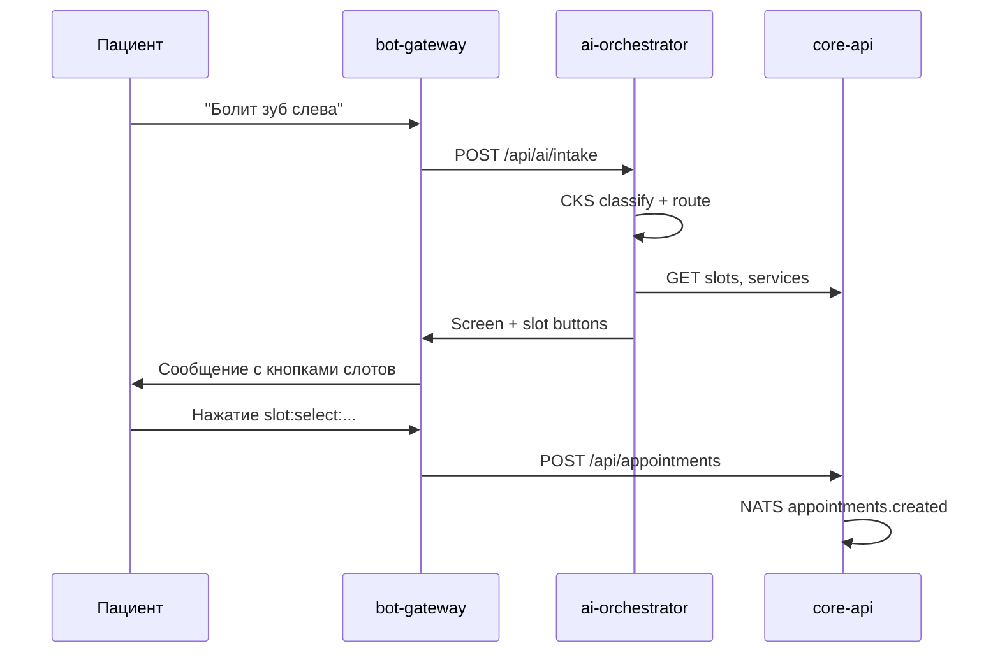

# Архитектура

## Обзор

Проект — монорепозиторий с несколькими микросервисами, общим пакетом `shared/` и инфраструктурой в Docker Compose.

## Сервисы приложения

| Сервис | Порт | Роль |
|--------|------|------|
| **bot-gateway** | 8180 | Telegram webhook/polling, UI, маршрутизация callback |
| **core-api** | 8100 | Доменная логика: пациенты, записи, слоты, аудит |
| **ai-orchestrator** | 8101 | CKS-классификация, intake, валидация AI-ответа |
| **crm-mock** | 8102 | Mock CRM/SRM для lookup и sync |
| **worker** | — | NATS consumers, напоминания, уведомления в Telegram |

## Инфраструктура

| Компонент | Назначение |
|-----------|------------|
| **PostgreSQL** | Пользователи, пациенты, записи, слоты, аудит |
| **Redis** | Rate limiting webhook |
| **NATS JetStream** | Асинхронные события между сервисами |

## Поток: текстовый intake

## Поток: кнопочная запись

1. Пациент: **Записаться** → список услуг.
2. Выбор услуги → свободные слоты из Core API.
3. Нажатие слота → `POST /api/appointments` с idempotency key.
4. Событие `appointments.created` → worker уведомляет пациента и staff.

## Общий код (`shared/`)

| Модуль | Назначение |
|--------|------------|
| `config.py` | Настройки из `.env` (pydantic-settings) |
| `schemas.py` | Pydantic-модели API и UI |
| `callbacks.py` | Парсинг и валидация `callback_data` |
| `security.py` | Webhook secret, rate limit, RBAC |
| `events.py` | NATS subjects и EventEnvelope |
| `nats.py` | EventPublisher |
| `telegram_client.py` | Bot + httpx с прокси |

## Сетевые особенности Docker

`bot-gateway` и `worker` запускаются с `network_mode: host`, чтобы обращаться к:

- прокси Telegram на `127.0.0.1:20170`;
- `core-api` на `127.0.0.1:8100`;
- NATS на `127.0.0.1:4224`.

Остальные сервисы работают в стандартной Docker-сети.

## Границы ответственности

!!! warning "Важно"
    - **bot-gateway** не хранит бизнес-данные и не решает, свободен ли слот.
    - **ai-orchestrator** не создаёт записи — только формирует экран с кнопками.
    - **core-api** — единственный источник правды по расписанию и ценам.
    - **worker** — только реакция на события, без прямого UI.

Детали по сервисам: раздел [Сервисы](services/bot-gateway.md).
