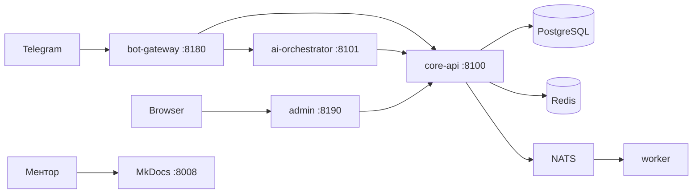

# Руководство для ментора

Краткая шпаргалка: как открыть проект, документацию и что проверить за 15–20 минут.

## Что это за проект

Гибридный **Telegram-бот стоматологической клиники** (MVP):

- пациент пишет текстом *или* идёт по кнопкам;
- AI **только маршрутизирует** (без диагнозов и без автозаписи);
- запись / перенос / отмена — **только кнопками**;
- backend — микросервисы на FastAPI + PostgreSQL + NATS + Redis.

Режим AI по умолчанию: **`AI_MODE=rules`** (локальные правила CKS, без OpenAI).

---

## Fly.io (для ментора — публичный доступ)

| Ресурс | URL |
|--------|-----|
| **Документация** | https://dental-mvp-docs.fly.dev |
| **Админ-панель** | https://dental-mvp-admin.fly.dev |
| **Telegram-бот (webhook)** | https://dental-mvp-bot.fly.dev |

Вход в админку: `ADMIN_TOKEN` из `.env` у разработчика.

Повторный деплой на Fly:

```bash
bash scripts/fly_deploy.sh
```

---

## Где смотреть документацию

| Ресурс | URL |
|--------|-----|
| **MkDocs (этот сайт)** | [http://127.0.0.1:8008](http://127.0.0.1:8008) |
| С той же машины в LAN | `http://<IP-ноутбука>:8008` |

Запуск только документации:

```bash
docker compose up -d docs
```

Или локально: `pip install -e ".[docs]" && mkdocs serve -a 0.0.0.0:8008`

---

## Где смотреть работающий проект

После `docker compose up -d --build`:

| Сервис | URL | Назначение |
|--------|-----|------------|
| **Документация** | http://127.0.0.1:8008 | MkDocs |
| **Админ-панель** | http://127.0.0.1:8190 | Дашборд, записи, демо |
| **Bot Gateway** | http://127.0.0.1:8180/health | Telegram-бот |
| **Core API** | http://127.0.0.1:8100/health | REST API |
| **AI Orchestrator** | http://127.0.0.1:8101/health | Intake / CKS |
| **CRM Mock** | http://127.0.0.1:8102/health | Mock CRM |

### Вход в админку

1. Откройте http://127.0.0.1:8190
2. Введите `ADMIN_TOKEN` из `.env` (у разработчика)
3. Раздел **Демо-сценарий** → кнопка **Запустить демо** (8 автоматических шагов)

### Telegram-бот

Бот работает в режиме **long polling**. Нужен `TELEGRAM_BOT_TOKEN` в `.env`.  
В РФ часто нужен локальный proxy (`TELEGRAM_PROXY_URL`) — см. [Быстрый старт](getting-started.md).

---

## Быстрая проверка (без Telegram)

```bash
# health всех сервисов
curl -s http://127.0.0.1:8180/health
curl -s http://127.0.0.1:8100/health
curl -s http://127.0.0.1:8101/health

# автоматический smoke-тест (нужен .env с секретами)
source .env
python3 scripts/smoke_test.py

# unit + integration тесты
pip install -e ".[test]"
pytest -q
# ожидается: 51 passed
```

Debug-симуляция бота (если `DEBUG_API_ENABLED=true`):

```bash
curl -X POST http://127.0.0.1:8180/debug/simulate \
  -H "X-Debug-Token: <ADMIN_TOKEN или DEBUG_API_TOKEN>" \
  -H 'Content-Type: application/json' \
  -d '{"message":{"chat":{"id":1001},"from":{"id":1001,"first_name":"Demo"},"text":"/start"}}'
```

---

## Что проверить по сценариям

| # | Сценарий | Ожидание |
|---|----------|----------|
| 1 | `/start` → **Продолжить** | Быстрая регистрация |
| 2 | **Записаться** → услуга → слот | Запись подтверждена |
| 3 | Текст: «Болит зуб слева» | AI показывает слоты кнопками |
| 4 | «Что у меня за болезнь?» | Отказ без диагноза |
| 5 | «Хочу имплантацию» | Услуга не в клинике |
| 6 | **Мои записи** | Список + перенос/отмена |
| 7 | Админ → **Демо-сценарий** | Все шаги зелёные |

Подробнее: [Демо-сценарий](demo.md), [Сценарии пользователя](user-flows.md).

---

## Архитектура (одним взглядом)



---

## Безопасность (кратко)

- Все `/api/*` Core API требуют **`X-Service-Token`** (`INTERNAL_SERVICE_TOKEN`).
- Операции пациента — ещё **`X-Telegram-User-Id`** + **`X-Patient-Proof`** (HMAC).
- Публичный `GET /api/audit` **удалён**; аудит только через `/api/admin/audit`.
- Webhook защищён `X-Telegram-Bot-Api-Secret-Token` + rate limit.

Полностью: [Безопасность](security.md).

---

## Карта документации

| Раздел | Для чего |
|--------|----------|
| [Быстрый старт](getting-started.md) | Docker, `.env`, proxy |
| [Архитектура](architecture.md) | Сервисы, NATS, потоки |
| [API](api/overview.md) | REST, заголовки, коды ответов |
| [Админ-панель](admin.md) | UI, демо, CSRF |
| [Тестирование](testing.md) | pytest, smoke |
| [Специфика клиники](clinic-spec.md) | Анкета под реальную клинику |

---

## Логи (для отладки)

```bash
cd /path/to/MVP

# все сервисы
docker compose logs -f

# один сервис
docker compose logs -f bot-gateway
docker compose logs -f core-api
docker compose logs -f worker
```

---

## Вопросы к разработчику

- Значение `ADMIN_TOKEN` и имя Telegram-бота
- Запущен ли proxy для Telegram (`TELEGRAM_PROXY_URL`)
- Заполнена ли [специфика клиники](clinic-spec.md) под реальное ТЗ
