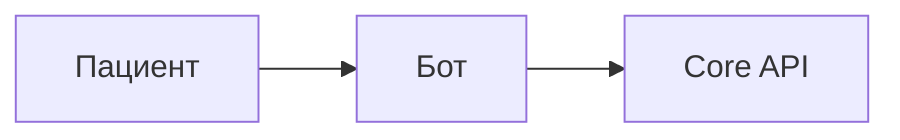

# Документация MkDocs

Проектная документация собирается в статический сайт с помощью [MkDocs](https://www.mkdocs.org/) и темы [Material for MkDocs](https://squidfunk.github.io/mkdocs-material/).

## Структура

```
MVP/
├── mkdocs.yml              # конфигурация сайта
├── docs/                   # исходники страниц (Markdown)
│   ├── index.md
│   ├── admin.md
│   ├── demo.md
│   ├── clinic-spec.md
│   ├── getting-started.md
│   └── ...
└── site/                   # собранный HTML (в .gitignore)
```

Конфигурация навигации — в `mkdocs.yml`, раздел `nav:`.

## Установка

```bash
cd /path/to/MVP
python3 -m venv .venv
source .venv/bin/activate
pip install -e ".[docs]"
```

Зависимости: `mkdocs`, `mkdocs-material` (см. `pyproject.toml` → `[project.optional-dependencies] docs`).

## Локальный просмотр

```bash
mkdocs serve
```

Откройте **http://127.0.0.1:8008**

Порт задан в `mkdocs.yml` (`dev_addr`). Если порт занят, измените его или запустите:

```bash
mkdocs serve -a 127.0.0.1:8010
```

## Сборка статики

```bash
mkdocs build
```

Результат — папка `site/`. Её можно выложить на любой статический хостинг.

## Публикация

### GitHub Pages

```bash
mkdocs gh-deploy
```

Требуется настроенный `git remote` и права на push в ветку `gh-pages`.

### Netlify / Vercel / nginx

Deploy директории `site/` как static site.

## Добавление новой страницы

1. Создайте файл `docs/my-page.md`
2. Добавьте в `mkdocs.yml`:

```yaml
nav:
  - Моя страница: my-page.md
```

3. Проверьте: `mkdocs serve`

## Возможности темы

В проекте включены:

| Функция | Описание |
|---------|----------|
| Поиск | Русский язык, подсказки |
| Тёмная тема | Переключатель в шапке |
| Mermaid | Диаграммы в fenced code blocks |
| Admonitions | `!!! note`, `!!! warning` |
| Копирование кода | Кнопка на блоках кода |
| TOC | Якоря у заголовков |

Пример Mermaid:

````markdown

````

## Карта документации

| Раздел | Файл | О чём |
|--------|------|-------|
| Главная | `index.md` | Обзор MVP |
| Специфика клиники | `clinic-spec.md` | Анкета под стоматологию |
| Админ-панель | `admin.md` | Web-UI на :8190 |
| Демо-сценарий | `demo.md` | Автопроверка бота |
| Быстрый старт | `getting-started.md` | Docker, `.env` |
| Архитектура | `architecture.md` | Сервисы, NATS |
| API | `api/*.md` | REST, callbacks, events |

## Связанные документы в репозитории

| Файл | Назначение |
|------|------------|
| `TZ_dental_bot.md` | ТЗ на согласование |
| `TZ_dental_bot_technical.md` | Техническое приложение |
| `README.md` | Краткий старт для разработчика |
| `STOMATOLOGY_CLINIC_SPEC.md` | Ссылка на `docs/clinic-spec.md` |

ТЗ не включены в MkDocs nav по умолчанию — при необходимости добавьте в `mkdocs.yml`.

## Troubleshooting

| Проблема | Решение |
|----------|---------|
| `command not found: mkdocs` | Активируйте venv, `pip install -e ".[docs]"` |
| `externally-managed-environment` | Используйте `python3 -m venv .venv` |
| Предупреждение MkDocs 2.0 | Material предупреждает о будущей версии; для MVP текущая связка работает |
| Страница не в меню | Добавьте в `nav` в `mkdocs.yml` |
