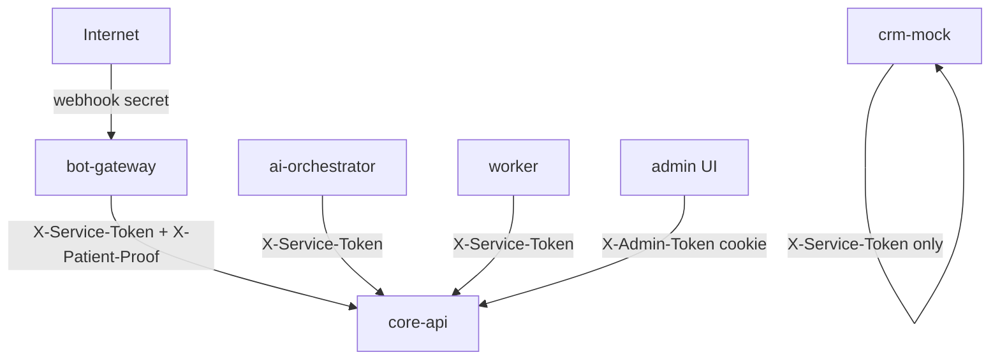

# Безопасность

Актуально для текущей версии MVP (локальный Docker Compose).

## Модель доступа



| Уровень | Механизм |
|---------|----------|
| **Сервис → Core API** | `X-Service-Token` = `INTERNAL_SERVICE_TOKEN` |
| **Пациентские мутации** | + `X-Telegram-User-Id` + `X-Patient-Proof` (HMAC, TTL 5 мин) |
| **Врач / staff** | `X-Role` + проверка `telegram_user_id` в БД |
| **Admin API** | `X-Admin-Token` |
| **Admin UI** | Session cookie + CSRF на POST-формах |
| **Webhook** | `X-Telegram-Bot-Api-Secret-Token` |
| **Debug API** | `X-Debug-Token` (только если `DEBUG_API_ENABLED=true`) |

Реализация: `shared/security.py`, `shared/service_auth.py`, `shared/patient_proof.py`.

---

## Service token (Core API, AI, CRM)

Все запросы к `/api/*` (кроме `/health`, `/debug/*`, `/api/admin/*`) проходят middleware:

```http
X-Service-Token: <INTERNAL_SERVICE_TOKEN>
```

Без токена → **401 Unauthorized**.

CRM mock (`/crm/*`) — тот же заголовок.

AI Orchestrator (`/api/ai/intake`) — тот же заголовок + rate limit 30 req/min на `telegram_user_id`.

---

## Patient proof

Для создания/отмены/переноса записи и просмотра чужих данных пациента:

```http
X-Telegram-User-Id: <telegram user id>
X-Patient-Proof: <timestamp>:<hmac-sha256>
```

HMAC считается от `telegram_user_id:timestamp` с ключом `INTERNAL_SERVICE_TOKEN`.

Bot-gateway добавляет заголовки автоматически через `internal_service_headers()`.

Прямой вызов API с чужим `patient_id` → **403 Forbidden**.

---

## Webhook

`POST /api/telegram/webhook`:

1. `X-Telegram-Bot-Api-Secret-Token` = `TELEGRAM_WEBHOOK_SECRET`
2. Rate limit: 60 req/min на IP (in-memory / Redis в bot state)

---

## RBAC (врачи и staff)

Врачебные эндпоинты проверяют:

- `X-Role` (`doctor`, `staff`, `admin`);
- `X-Telegram-User-Id` совпадает с `doctor.telegram_user_id` в БД **или** ID в `STAFF_TELEGRAM_IDS`.

Одного заголовка `X-Role: doctor` **недостаточно**.

---

## Admin panel

| Защита | Описание |
|--------|----------|
| Session | Cookie `admin_session` (opaque id, TTL 24 ч) |
| CSRF | Cookie + hidden field на POST `/login`, `/demo/*` |
| API | Проксирует `X-Admin-Token` в Core API |

---

## Debug endpoints

| Путь | Условие |
|------|---------|
| `POST /debug/simulate` | `DEBUG_API_ENABLED=true` + `X-Debug-Token` |
| `GET /debug/ai-call-count` | то же |
| `GET /debug/events` (core-api) | то же |

В production: `DEBUG_API_ENABLED=false` → **404**.

---

## Закрытые / внутренние эндпоинты

| Эндпоинт | Доступ |
|----------|--------|
| `GET /api/audit` | **Удалён** (был публичным) |
| `GET /api/admin/audit` | Только `X-Admin-Token` |
| `GET /api/reminders/due` | Только `X-Service-Token` |
| `POST /api/notifications` | Только `X-Service-Token` |

---

## Callback data

- Максимум 64 символа.
- Без PII (телефон, email).
- Только разрешённые namespace (`shared/callbacks.py`).

## Idempotency

Критичные `POST` требуют `Idempotency-Key`. Повтор с тем же ключом — тот же ответ без дубликата.

## Слоты и гонки

Два одновременных бронирования одного слота → второй запрос **HTTP 409**.

## AI Safety

| Проверка | Файл |
|----------|------|
| Клинические вопросы | `is_clinical_question()` — паттерны + фразы |
| Нет диагноза в ответе | `FORBIDDEN_MEDICAL_PATTERNS` |
| Реальные slot_id / service_id | `validate_ai_screen()` |

## Сеть (Docker)

Инфраструктура и API привязаны к **127.0.0.1** на хосте:

- Postgres `55432`, Redis `6380`, NATS `4224`
- Core `8100`, AI `8101`, CRM `8102`

Bot-gateway и admin — `network_mode: host` (доступ к локальному proxy).

## Секреты

| Переменная | Рекомендация |
|------------|--------------|
| `INTERNAL_SERVICE_TOKEN` | Случайная строка ≥ 32 символов |
| `ADMIN_TOKEN` | Не `change-me-admin-token` |
| `TELEGRAM_WEBHOOK_SECRET` | Случайная строка |
| `.env` | В `.gitignore`, не коммитить |

При старте слабые секреты логируются: `shared/startup_checks.py`.

## Чеклист production

- [ ] Сильные `INTERNAL_SERVICE_TOKEN`, `ADMIN_TOKEN`
- [ ] `DEBUG_API_ENABLED=false`
- [ ] HTTPS для webhook
- [ ] Firewall: только нужные порты
- [ ] Бэкапы PostgreSQL
- [ ] Ротация токена бота при утечке
