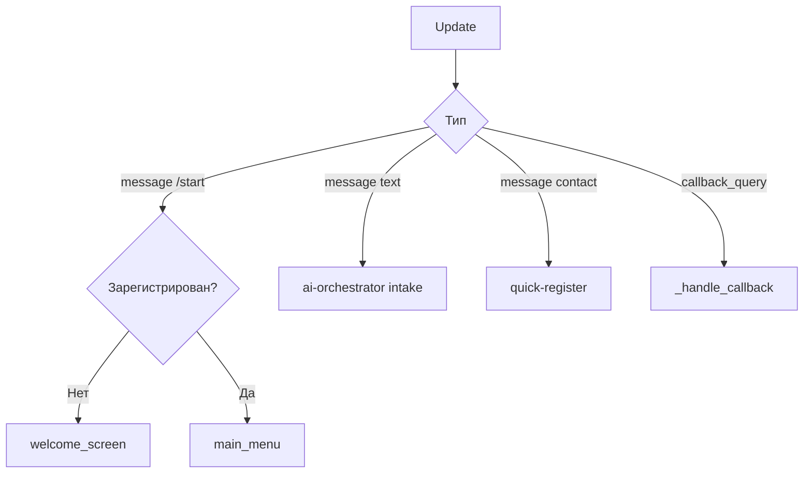

# Bot Gateway

**Порт:** `8180`  
**Стек:** FastAPI + aiogram

## Назначение

Единственная точка входа из Telegram. Принимает updates (webhook или long polling), рендерит экраны с inline-кнопками, делегирует бизнес-логику в Core API и AI Orchestrator.

## Режимы работы

| Режим | Переменная | Описание |
|-------|------------|----------|
| Polling | `TELEGRAM_MODE=polling` | `getUpdates` в цикле, webhook удаляется |
| Webhook | `TELEGRAM_MODE=webhook` | `POST /api/telegram/webhook` |

## Эндпоинты

| Метод | Путь | Описание |
|-------|------|----------|
| GET | `/health` | Health check |
| POST | `/api/telegram/webhook` | Telegram webhook |
| POST | `/debug/simulate` | Симуляция update без Telegram |
| GET | `/debug/ai-call-count` | Счётчик обращений к AI |

## Модули

| Файл | Роль |
|------|------|
| `main.py` | Роутинг update, handlers, интеграция с API |
| `rendering.py` | Экраны, layout кнопок, `to_telegram_markup` |

## Рендеринг UI

- Кнопки без emoji (по ТЗ).
- Двухколоночный layout в главном меню (`button_layout: [2, 2, 1]`).
- Единые **Назад** и **Главное меню** на подэкранах.
- `callback_data` валидируется через `shared/callbacks.py`.

## Обработка update

При каждом callback вызывается `answerCallbackQuery` для отклика на нажатие.

## Зависимости

- `CORE_API_URL` — `http://127.0.0.1:8100` (host network)
- `AI_ORCHESTRATOR_URL` — `http://127.0.0.1:8101`
- `TELEGRAM_PROXY_URL` — прокси для Telegram API
